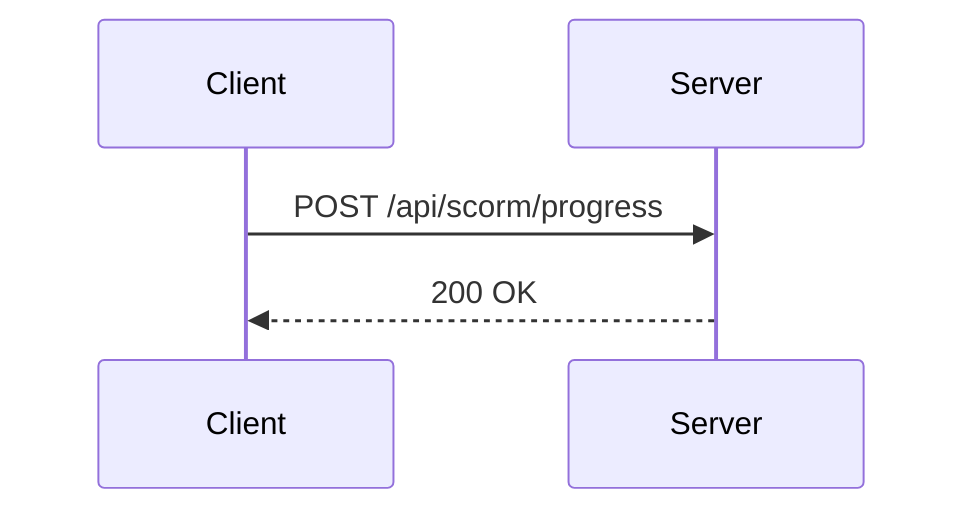
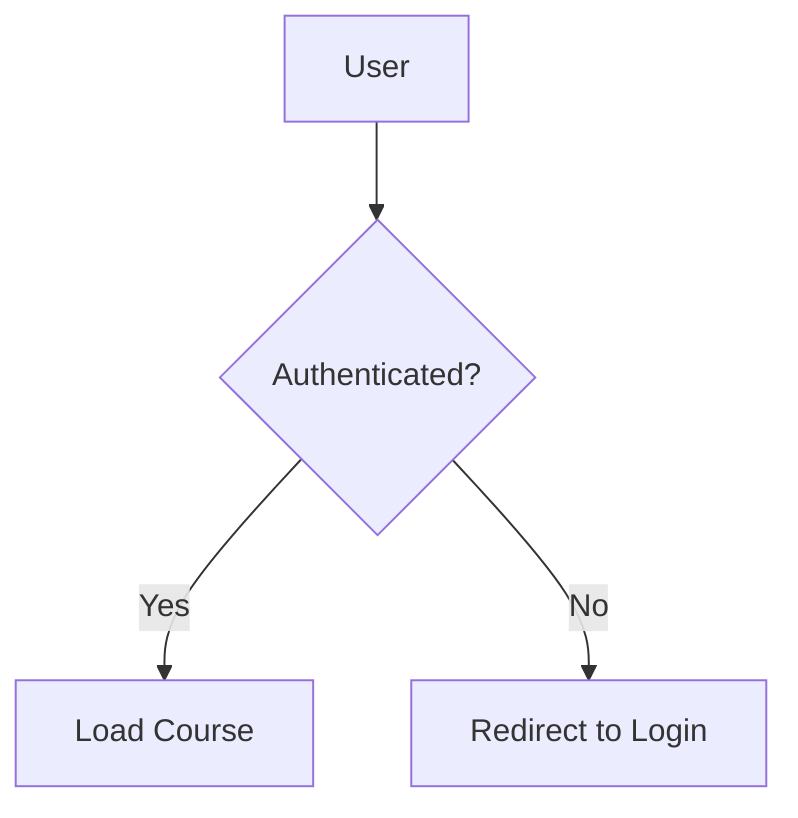

# Documentation Writing

## When to Apply

Activate this skill when:

- Creating or editing documentation files in `docs/`
- Writing guides, explanations, or reference docs
- Setting up the documentation toolchain for the first time
- The user asks to "document", "write docs", or "add a guide" for a feature

---

## Toolchain Setup

Run this setup when `astro.config.js` does not yet exist at the project root.

### 1. Install packages

Add to `devDependencies` in `package.json`:

```json
"@astrojs/starlight": "^0.38.1",
"astro": "^6.0.5",
"astro-mermaid": "1.3.1",
"starlight-llms-txt": "^0.8.0"
```

Add to the `scripts` block in `package.json`:

```json
"build:docs": "astro build",
"dev:docs": "astro dev --port 4322"
```

Then run `npm install`.

### 2. Create `astro.config.js`

Read `.claude/skills/doc-writing/astro.config.template.js` and copy it to `astro.config.js` at the project root. Then fill in the `TODO` values:

| Placeholder | What to set |
|---|---|
| `YOUR-PROJECT.test/docs` | Actual site base URL |
| `PROJECT NAME` | Human-readable project name for the navbar |
| `short description` | One-sentence description for SEO |
| `ORG/REPO` | GitHub org and repo name |

### 3. Create content collection config

Read `.claude/skills/doc-writing/content.config.template.ts` and copy it to `docs/src/content.config.ts`. No changes needed — it can be used as-is.

### 4. Directory structure

```
docs/
├── api/
│   └── spec.yaml              # OpenAPI spec root file (input for Redocly)
├── public/                    # Static assets served at /docs/
│   └── api/
│       └── bundle.yml         # Generated — do not edit manually
└── src/
    └── content/
        └── docs/
            ├── guides/        # How-to guides (autogenerated sidebar)
            └── explanation/   # Conceptual explanations (autogenerated sidebar)
```

---

## Writing Documentation

### File format

All documentation pages use `.mdx` (preferred — supports components) or `.md`. Place them under `docs/src/content/docs/`.

```mdx
---
title: Page Title
description: Short description for search engines and social previews.
---

Content here.
```

### Frontmatter fields

| Field | Type | Notes |
|---|---|---|
| `title` | `string` | **Required.** Shown at top of page, in `<title>`, and in sidebar |
| `description` | `string` | Used by search engines and social previews |
| `sidebar.order` | `number` | Sort position in autogenerated groups |
| `sidebar.label` | `string` | Override link text in the sidebar |
| `sidebar.hidden` | `boolean` | `true` removes page from autogenerated sidebars |
| `sidebar.badge` | `string \| { text, variant }` | Badge on the sidebar link. Variants: `note`, `tip`, `danger`, `caution`, `success` |
| `template` | `'doc' \| 'splash'` | `'splash'` gives a wide landing-page layout |
| `draft` | `boolean` | Hidden in production; visible in dev |
| `lastUpdated` | `Date \| boolean` | Override global setting for this page |
| `pagefind` | `boolean` | `false` excludes page from search index |

### Content types

**Guides** (`docs/src/content/docs/guides/`) — Step-by-step instructions for completing a task. Use imperative titles: "Configuring Authentication", "Setting Up SCORM".

**Explanations** (`docs/src/content/docs/explanation/`) — Conceptual background for understanding how and why. Use noun-phrase titles: "Authentication Architecture", "SCORM Data Flow".

### Callouts / Asides

```md
:::note
A neutral informational note.
:::

:::tip[Custom title]
A helpful tip with a custom title.
:::

:::caution
A warning about potential issues.
:::

:::danger
A critical warning.
:::
```

### Code blocks

Code blocks use Expressive Code with enhanced features:

````md
```js title="example.js" {2-3} ins={5} del={4}
// title= renders a file tab frame
// {2-3} highlights lines 2–3
// ins={5} marks line 5 as inserted (green)
// del={4} marks line 4 as deleted (red)
```
````

Shell languages (`bash`, `sh`, `zsh`) auto-render as terminal frames.

### Diagrams with Mermaid

Use fenced `mermaid` code blocks. All standard diagram types are supported.

````md

````

````md

````

### Built-in Starlight components (MDX only)

Import from `@astrojs/starlight/components`:

```mdx
import { Card, CardGrid, Tabs, TabItem, Steps, Badge, FileTree, LinkCard } from '@astrojs/starlight/components';

<Steps>
1. Install dependencies.
2. Configure the module.
3. Run migrations.
</Steps>

<Tabs>
  <TabItem label="npm">npm install foo</TabItem>
  <TabItem label="pnpm">pnpm add foo</TabItem>
</Tabs>

<FileTree>
- app/
  - Modules/
    - SCORM/
      - Http/
      - Models/
</FileTree>
```

---

## Dev Server

```bash
npm run dev:docs
```

Starts Astro's dev server at `http://localhost:4322/docs` with hot-reload. Content changes and config edits reflect instantly without a full rebuild.

:::note
The dev server runs independently of the Laravel/Vite dev server. Both can run at the same time.
:::

## Building

```bash
# Build the docs site to docs/dist/
npm run build:docs
```

---

## Cross-linking with the API Reference

If an OpenAPI spec also exists at `docs/api/spec.yaml`, link to the API reference from the docs site. Add a `LinkCard` to the index page or the relevant guide:

```mdx
import { LinkCard } from '@astrojs/starlight/components';

<LinkCard
  title="API Reference"
  href="/docs/api/"
  description="Browse the full REST API reference."
/>
```

The standalone API docs HTML is generated by `npm run preview:api-docs` and output to `public/docs/api/index.html`. Confirm this path is being served correctly before adding the link.

---

## Common Pitfalls

- Forgetting `npm install` after adding packages to `package.json`
- Placing `mermaid()` after `starlight()` in `integrations` — it must come first
- Using `.md` files that contain JSX/components — use `.mdx` instead
- Placing content outside `docs/src/content/docs/` — Starlight only autogenerates from that path
- Starting headings at `#` (h1) — Starlight renders `title` frontmatter as h1; start body headings at `##`
- Not setting `site` in `astro.config.js` — required for sitemap and canonical URLs
